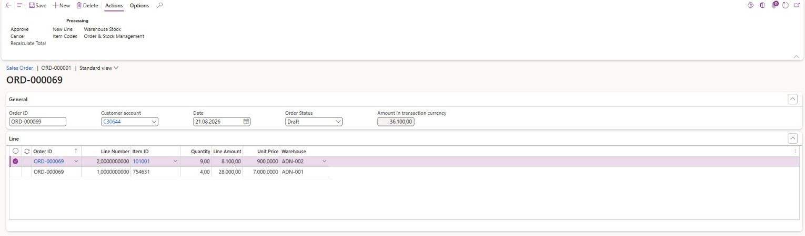
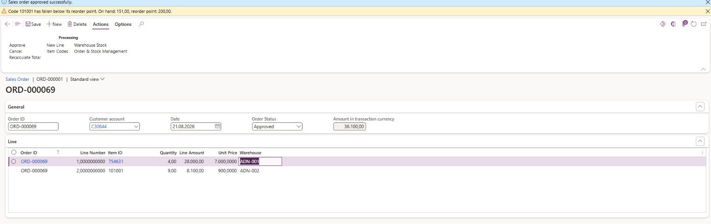
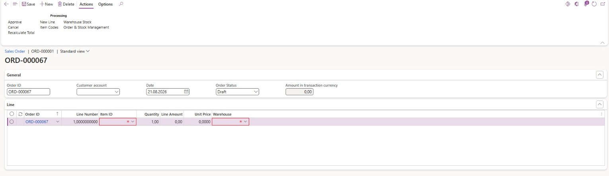

# D365 Sales Order Management

A Dynamics 365 Finance & Operations internship project focused on building a custom sales order management module with X++, AOT metadata, data entities, validation logic, services, security artifacts, and basic test coverage.

This repository is a cleaned public snapshot of the SOrder module from a larger Order & Stock Management training project.

## Internship Context

This project was developed during my internship while learning Dynamics 365 Finance & Operations and X++ for the first time. It represents the foundation module where I practiced D365 application patterns such as custom tables, forms, service classes, number sequences, data entities, security configuration, and unit test style classes.

## Article

I wrote a detailed article about this project and the learning process behind it:

[Internship Journey / Part 1: D365 Sales Order Management](https://medium.com/@siracsuz/internship-journey-part-1-d365-sales-order-management-43d62a843157)

## Features

- Custom sales order header and line tables
- Sales order form and list part
- Draft, approved, and cancelled order statuses
- Order validation rules
- Total amount recalculation logic
- Number sequence setup for generated order IDs
- Data entities for order header and line import/export scenarios
- Security role, duties, and privileges
- Parameter form for module setup
- Test classes for order table and line behavior

## Screenshots

### Sales Order Form



### Approval Flow



### Line Validation



## Tech Stack

- Microsoft Dynamics 365 Finance & Operations
- X++
- D365 AOT metadata XML
- D365 security artifacts
- D365 data entities

## Project Structure

```text
src/
  classes/              Service, recalculation, and number sequence classes
  tables/               SOrder tables and staging tables
  forms/                Order, list part, and parameter forms
  edts/                 Required extended data types
  enums/                Order status enum
  data-entities/        Header and line data entities
  menu-items/           Menu and display menu items
  security/             Role, duties, and privileges
  tests/                Test classes from the training project
  labels/               Label metadata and English label resources
  extensions/           Custom extensions related to the module
docs/
  scope.md              Notes about included artifacts and module boundaries
screenshots/
  Cropped demo screenshots showing the sales order form, approval flow, and line validation
```

## Main Business Flow

1. A sales order header is created with customer, date, status, and total amount information.
2. Sales order lines are added with item, quantity, unit price, and calculated line amount.
3. Validation rules protect the order lifecycle and line data.
4. The recalculation service updates order totals from line amounts.
5. Orders can move through draft, approved, and cancelled states.
6. Number sequence setup supports generated order IDs.
7. Data entities expose order header and line data for integration style scenarios.

## Architecture Overview

The SOrder module shows the core building blocks of a custom D365 feature:

```text
SOrderTable
  Stores sales order header information

SOrderLine
  Stores line level item, quantity, price, and amount information

SOrderService
  Handles approval, cancellation, and business validation behavior

SOrderRecalculateService
  Recalculates header totals from order lines

SOrderHeaderEntity / SOrderLineEntity
  Expose order data through D365 data entity metadata

SOrderRole / Duties / Privileges
  Define security access for maintaining and viewing the module
```

## Notes

This repository is intended as a portfolio source snapshot rather than a complete deployable D365 model package.

The original internship project combined this sales order module with a later inventory management module. The inventory focused part is documented separately in [`d365-inventory-stock-management`](https://github.com/qileon/d365-inventory-stock-management).

For detailed inclusion notes, see [`docs/scope.md`](docs/scope.md).
